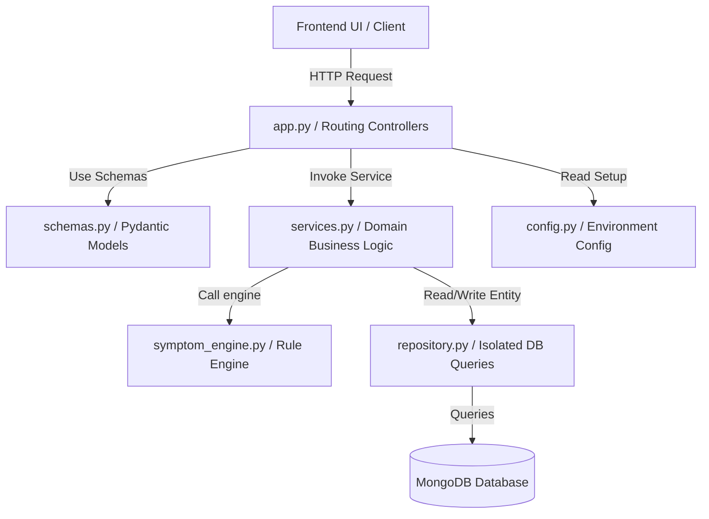

# AI Agent Developer Guide & Harness Architecture

Welcome! This repository is designed to be fully legible, structured, and extensible for autonomous AI agents. To maintain codebase integrity as it scales, all agents must adhere to the mechanical layers and architectural standards detailed below.

---

## 1. Codebase Architecture & Layers

This project enforces a strict, decoupled layered design based on SOLID and DRY principles. Do not bypass these boundaries.



### Architectural Layer Specifications

| Layer | File / Location | Responsibility | Constraints |
| :--- | :--- | :--- | :--- |
| **Config** | [config.py](file:///Users/pradumnpatidar/Downloads/mlopstraining/backend/config.py) | Centralized environment variable loading & validation. | No raw `os.getenv` calls are allowed in other files. |
| **Schemas** | [schemas.py](file:///Users/pradumnpatidar/Downloads/mlopstraining/backend/schemas.py) | Pydantic validation schemas defining route contracts. | Must not contain database queries or route actions. |
| **Repository** | [repository.py](file:///Users/pradumnpatidar/Downloads/mlopstraining/backend/repository.py) | Direct MongoDB CRUD operations (`UserRepository`, `PredictionRepository`, `ChatRepository`). | Must not import `services.py` or know about HTTP controllers. |
| **Service** | [services.py](file:///Users/pradumnpatidar/Downloads/mlopstraining/backend/services.py) | Business domain logic (OTP lifecycle, email SMTP connections, diagnostic workflows). | Must not directly access databases or `pymongo`. |
| **Controller** | [app.py](file:///Users/pradumnpatidar/Downloads/mlopstraining/backend/app.py) | FastAPI routing, CORS middleware, and HTTP response serialization. | Must remain lean. Delegate logic to services & repositories. |

---

## 2. Mechanical Architecture Linter (Harness)

To prevent code degradation, the project includes an automated linter:
- **Linter Script:** [harness.py](file:///Users/pradumnpatidar/Downloads/mlopstraining/backend/harness.py)
- **Rules checked:**
  - Controllers (`app.py`) must not directly import `pymongo` or `MongoClient`.
  - Controllers must not call `os.getenv` for app configs (use `Config` settings instead).
  - Services (`services.py`) must not directly import or configure `pymongo` (isolate database queries inside the repository layer).
  - Repositories (`repository.py`) must not import `services` (avoiding upward cyclic dependencies).

### Run Harness Checks
Before committing any changes, verify structural compliance:
```bash
python3 backend/harness.py
```

---

## 3. Developer Tools & Integrations

### Upstash Context7 (Documentation Retrieval)
Context7 is integrated to fetch real-time, version-specific library documentation, reducing LLM hallucinations.

- **CLI Installation (Global):**
  ```bash
  npm install -g ctx7
  ctx7 setup
  ```
- **MCP Configuration (Claude / Cursor):**
  Add the following server object to your developer configuration:
  ```json
  {
    "mcpServers": {
      "context7": {
        "command": "npx",
        "args": ["-y", "@upstash/context7-mcp"],
        "env": {
          "CONTEXT7_API_KEY": "YOUR_API_KEY"
        }
      }
    }
  }
  ```

### Understand-Anything (Interactive Knowledge Graph)
Understand-Anything is used to visualize complex dependency graphs and analyze the codebase structure.

- **Installation:**
  ```bash
  curl -fsSL https://raw.githubusercontent.com/Lum1104/Understand-Anything/main/install.sh | bash
  ```

---

## 4. Solid & Dry Guidelines for Extension

When adding features, strictly verify compliance:
1. **Single Responsibility (SRP):** Write small, focused classes. Keep database calls, validation models, and business services isolated.
2. **Open-Closed Principle (OCP):** Add new symptom classification rules inside `symptom_engine.py` rules array rather than modifying existing engine loops.
3. **Don't Repeat Yourself (DRY):** Reuse helper services (e.g. `OTPService`, `EmailService`) instead of recreating timers, generation sequences, or SMTP bindings in new files.
