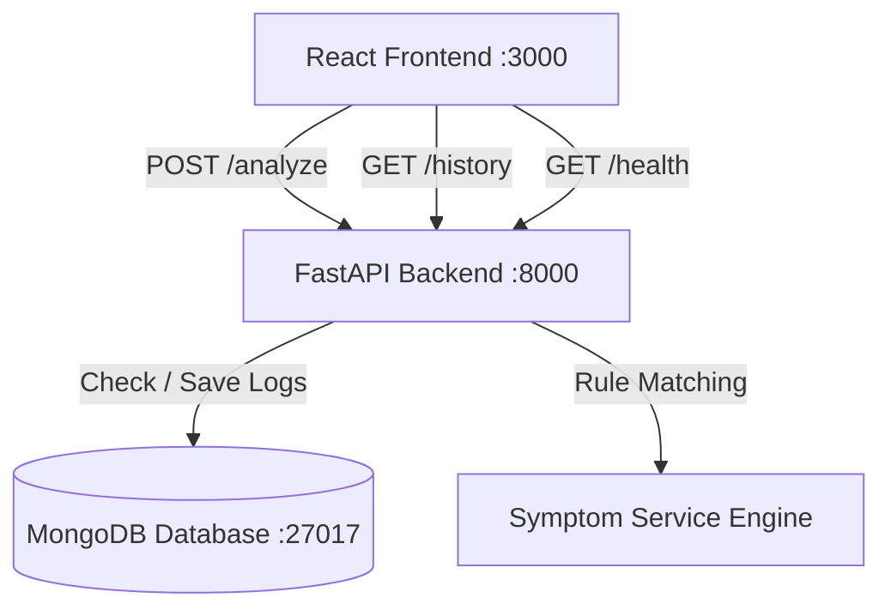

# AI Healthcare Assistant

A premium, modern healthcare guidance web application built with a **React + Vite** frontend, a **Python FastAPI** backend, and a **MongoDB** database, fully containerized with **Docker** and **Docker Compose**.

It analyzes user symptoms using a rule-based engine, suggests doctor specializations, detects emergency cases, displays risk levels, provides first-care advice, suggests nearby hospitals using Google Maps, and records analysis history in MongoDB.

> [!WARNING]
> **Medical Disclaimer:** This app does not provide medical diagnoses. It only provides basic healthcare guidance and suggests doctor specializations based on matching rules. In a medical emergency, seek professional care immediately.

---

## Architecture & How It Works



1. **Frontend (React + Vite)**: Renders a premium interface (with Glassmorphism cards, dynamic glowing risk badges, light/dark modes, and quick-tag symptom buttons). It sends asynchronous requests to the FastAPI backend.
2. **Backend (FastAPI)**: Serves endpoints for symptom analysis (`/analyze`), fetching scan logs (`/history`), and status updates (`/health`).
3. **Rule-Based Engine (`symptom_engine.py`)**: An isolated service file that scans text inputs against symptom keywords to recommend specializations, risk levels, and warning advice.
4. **Database (MongoDB)**: Stores prediction logs containing symptoms, recommendations, and timestamps.
5. **Docker Compose**: Orchestrates all three services into isolated bridge networks for easy deployment.

---

## File Structure

```text
mlopstraining/
├── backend/
│   ├── app.py              # FastAPI server and endpoints
│   ├── database.py         # MongoDB client initialization & queries
│   ├── symptom_engine.py   # Symptom rule-based logic helper
│   ├── requirements.txt    # Python dependencies
│   ├── Dockerfile          # FastAPI Docker configuration
│   └── .env                # Local backend environment file
│
├── frontend/
│   ├── index.html          # Vite React HTML entrypoint
│   ├── package.json        # Node dependency manifest
│   ├── vite.config.js      # Vite dev/build config
│   ├── Dockerfile          # Production multi-stage Nginx build
│   └── src/
│       ├── main.jsx        # React DOM mount loader
│       ├── App.jsx         # Main UI component (state, forms, history)
│       └── App.css         # Premium custom Vanilla CSS design system
│
├── .env.example            # Environment variables example template
├── docker-compose.yml      # Docker Compose orchestration configurations
└── README.md               # User manual and documentation (This file)
```

---

## Run Using Docker (Recommended)

Docker Compose starts the database, backend API, and React client automatically with a single command.

### Prerequisites
Make sure you have **Docker** and **Docker Compose** installed.

### Steps
1. In the root of the project (`mlopstraining`), run:
   ```bash
   docker-compose up --build
   ```
2. Wait for the containers to compile and boot.
3. Open your browser and navigate to:
   - **Frontend**: [http://localhost:3000](http://localhost:3000)
   - **FastAPI API Docs**: [http://localhost:8000/docs](http://localhost:8000/docs)
   - **API Health Check**: [http://localhost:8000/health](http://localhost:8000/health)

To stop the containers, run:
```bash
docker-compose down
```

---

## Run Locally (Manual Setup)

If you prefer to run the components directly on your host machine, follow these steps.

### Prerequisites
- **Python 3.10+**
- **Node.js 18+** & **npm**
- **MongoDB** running locally on port `27017` (e.g. `brew services start mongodb-community` on macOS, or a Docker MongoDB container).

### 1. Set Up and Run the Backend

1. Navigate to the `backend` folder:
   ```bash
   cd backend
   ```
2. Create and activate a Python virtual environment:
   - **Mac/Linux:**
     ```bash
     python3 -m venv venv
     source venv/bin/activate
     ```
   - **Windows:**
     ```bash
     python -m venv venv
     venv\Scripts\activate
     ```
3. Install dependencies:
   ```bash
   pip install -r requirements.txt
   ```
4. Configure environment:
   Make sure `backend/.env` has the correct `MONGO_URI` set to your local MongoDB instance:
   ```ini
   MONGO_URI=mongodb://localhost:27017/healthcare_db
   PORT=8000
   HOST=0.0.0.0
   ```
5. Run the FastAPI development server:
   ```bash
   python app.py
   ```
   The backend will be running at [http://localhost:8000](http://localhost:8000).

---

### 2. Set Up and Run the Frontend

1. Open a new terminal and navigate to the `frontend` folder:
   ```bash
   cd frontend
   ```
2. Install npm packages:
   ```bash
   npm install
   ```
3. Start the Vite development server:
   ```bash
   npm run dev
   ```
4. Open the URL displayed in the terminal (usually [http://localhost:3000](http://localhost:3000)).
# MediGuard
# MediGuard
