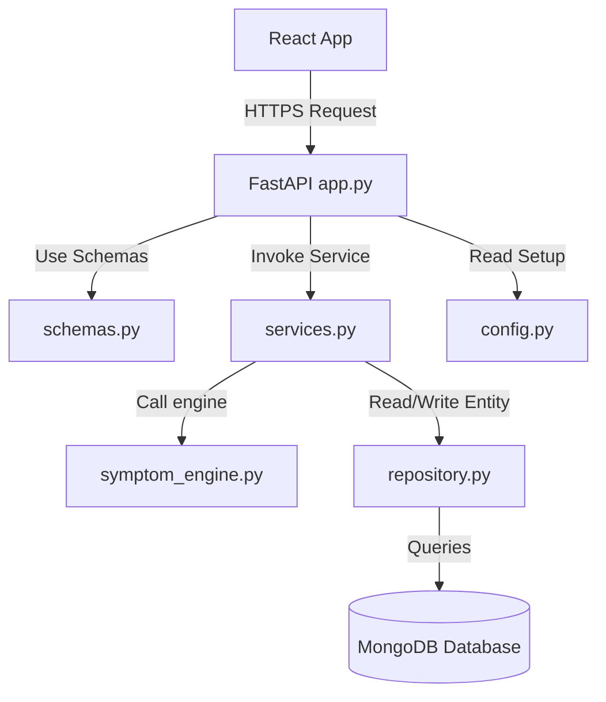

# Onboarding Guide - AI Healthcare Assistant

Welcome to the **AI Healthcare Assistant** project! This document serves as your onboarding roadmap to help you and subsequent development agents quickly understand the repository's structure, layers, core patterns, and hotspots.

---

## 1. Project Overview

*   **Project Name**: AI Healthcare Assistant
*   **Languages**: Python (Backend), JavaScript/React (Frontend), CSS, YAML, Markdown
*   **Frameworks**: FastAPI, React (Vite), MongoDB, Docker, Tailwind/Vanilla CSS
*   **Description**: An AI-powered healthcare symptom advisor and clinical wellness chat portal. It Suggests doctor specializations, emergency warnings, first-care recommendations, and hosts an interactive diagnostic wellness chatbot with report upload capabilities.

---

## 2. Architecture Layers

To ensure that the codebase remains scalable and free of architectural drift, we enforce a strict layered architecture:

*   **Configuration Layer** (`config.py`): Centralized environment loader. All database connections and third-party credentials load here.
*   **Schemas Validation Layer** (`schemas.py`): Holds Pydantic validation schemas defining request/response structures.
*   **Database Repository Layer** (`repository.py`): Encapsulates isolated database entity queries. Web routes do not import pymongo.
*   **Domain Services Layer** (`services.py` + `symptom_engine.py`): Core logic for email notification SMTP triggers, memory-based OTP lifecycle, and rule-based diagnostic analysis.
*   **Web Controller Layer** (`app.py`): Slim FastAPI router exposing RESTful endpoints.
*   **Frontend UI Layer** (`frontend/src/`): React Vite single-page dashboard.

---

## 3. Key Concepts & Guidelines

1.  **SOLID Single Responsibility Principle (SRP)**: Keep database operations, Pydantic schemas, routes, and business rules in their respective files.
2.  **DRY (Don't Repeat Yourself)**: Reuse services (e.g. `OTPService`, `EmailService`) rather than writing redundant OTP counters or SMTP calls across endpoints.
3.  **Simulation & Offline Mode Support**: If SMTP hosts are not configured in `.env`, the backend falls back to logging the OTP in the terminal and returning it in the HTTP response so developers can easily test.
4.  **Google Antigravity SDK Integration**: The wellness chat relies on the `google.antigravity` package to run stateful diagnostic chat sessions, persisting conversation IDs in MongoDB.
5.  **Architectural Compliance Linter**: Before committing changes, run `python3 backend/harness.py`. If there are direct database calls in routing files, the harness checks will fail and block compilation.

---

## 4. Guided Tour

Here is the recommended path to trace files in order of dependency:

1.  [AGENTS.md](file:///Users/pradumnpatidar/Downloads/mlopstraining/AGENTS.md): Read this first to understand coding standards and structural expectations.
2.  [config.py](file:///Users/pradumnpatidar/Downloads/mlopstraining/backend/config.py): Understand how variables are validated.
3.  [schemas.py](file:///Users/pradumnpatidar/Downloads/mlopstraining/backend/schemas.py): See what data structures are modeled.
4.  [repository.py](file:///Users/pradumnpatidar/Downloads/mlopstraining/backend/repository.py): Check how data objects (users, predictions, chat histories) are stored in collections.
5.  [services.py](file:///Users/pradumnpatidar/Downloads/mlopstraining/backend/services.py): Understand core business lifecycle operations.
6.  [app.py](file:///Users/pradumnpatidar/Downloads/mlopstraining/backend/app.py): Trace the HTTP route boundaries.
7.  [App.jsx](file:///Users/pradumnpatidar/Downloads/mlopstraining/frontend/src/App.jsx): Analyze how the React UI connects to these endpoints.

---

## 5. File Map

| File Path | Layer | Purpose |
| :--- | :--- | :--- |
| `backend/config.py` | Config | Unifies environment parameter parsing. |
| `backend/schemas.py` | Schemas | Request validation models. |
| `backend/repository.py` | Repository | Direct CRUD database access interface. |
| `backend/services.py` | Service | Business transactions (verification, emails, diagnosis). |
| `backend/symptom_engine.py` | Service | Local rule engine for symptoms. |
| `backend/app.py` | Controller | Routing entry point & Antigravity Agent context. |
| `backend/harness.py` | Harness | Mechanical architecture linter check. |
| `frontend/src/App.jsx` | UI | Frontend layouts, Leaflet Map, and chatbot. |
| `frontend/src/App.css` | UI | Healthcare color themes and mobile-responsive styling. |

---

## 6. Complexity Hotspots

Approach modifications to these files with extra care:

1.  **[frontend/src/App.jsx](file:///Users/pradumnpatidar/Downloads/mlopstraining/frontend/src/App.jsx)** (~1,450 lines)
    *   *Complexity*: Complex
    *   *Details*: Manages the entire single-page React app state (authentication credentials, signup overlays, Leaflet OpenStreetMap integrations, chat widget, simulated mock inbox alerts).
2.  **[frontend/src/App.css](file:///Users/pradumnpatidar/Downloads/mlopstraining/frontend/src/App.css)** (~2,200 lines)
    *   *Complexity*: Complex
    *   *Details*: Styling for landing page animations, glassmorphism templates, responsive grids, and sidebar configurations.
3.  **[backend/app.py](file:///Users/pradumnpatidar/Downloads/mlopstraining/backend/app.py)** (~480 lines)
    *   *Complexity*: Moderate
    *   *Details*: Exposes endpoints, parses report file uploads, feeds patient diagnostic history as LLM context, and executes the stateful wellness chat loops.

---

*Note: The onboarding guide has been checked for design standards and is ready for the team to use!*
